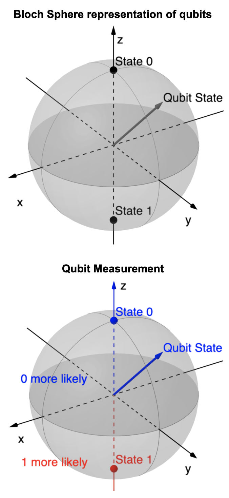

<header><h1 style='font-size: 25pt'>node-red-quantum</h1></header>

# Prologue

**Node-RED Quantum** provides a set of nodes to build and run quantum computing algorithms within Node-RED.

Please be aware that this is a  **development version** of Node-RED Quantum, it is still a work in progress and the code is unstable. A full production-ready release will be published soon.

This module is a user-friendly library that is suitable for new quantum computing users thanks to its extensive documentation. It was designed to facilitate the integration of quantum algorithms within classical programs and is fully scalable since all the elemental quantum operations are included. 

This Node-RED library was developed in the context of a [UCL IXN](https://www.ucl.ac.uk/computer-science/collaborate/ucl-industry-exchange-network-ucl-ixn) partnership with [IBM](https://www.ibm.com/uk-en). Defined and arranged by IBM, the project was allocated to students from UCL's computer science department as part of their Master's thesis. 

For the latest changes, please read the [CHANGELOG](CHANGELOG.md).

For more details on the authors, please read the [AUTHORS](AUTHORS) file.

For information on how to contribute, please read the [CONTRIBUTING](CONTRIBUTING.md) guidelines.

  

# Table of contents
- [Prologue](#prologue)
- [Table of contents](#table-of-contents)
- [Pre-requisites](#pre-requisites)
- [Install](#install)
- [About Quantum Computing](#about-quantum-computing)
- [*'Quantum'* nodes - Building quantum circuits](#quantum-nodes---building-quantum-circuits)
- [*'Quantum Algorithms'* nodes - Leveraging quantum computing](#quantum-algorithms-nodes---leveraging-quantum-computing)
- [Tutorials & Examples](#tutorials--examples)

  

# Pre-requisites
Node-RED Quantum requires at minimum [Node-RED 1.0](https://nodered.org) and [Python 3](https://www.python.org/).

  

# Install

  

# About Quantum Computing

<h3>Qubit State</h3>

    

        A qubit is the same to a quantum computer than what a bit is to a classical computer: the smallest unit of information.
          
        <a href="https://qiskit.org/textbook/ch-states/representing-qubit-states.html#statevectors"> Classical vs Quantum bits - Qiskit textbook</a>
          
        The <b>Bloch sphere</b> representation is considered as the most simple and ludic way to understand & visualise a qubit (see image below).
          
        In contrast with classical bits that can only be in a '0' or a '1' state, qubits can store much more information.
        In fact, all points on the sphere represent a different qubit state, the usual classical bit states being labelled as:
        <ul>
        <li>State 0</li>
        <li>State 1</li>
        </ul>
        Quantum states that are in between those 2 points are a weighted combination of the '0' and '1' states. This is called <b>superposition</b>.  
        To set the qubit in a particular state, we operate rotations or reflections of the <b>Bloch sphere</b> while keeping the x, y and z axis unchanged.
          
        <b>Example:</b> Applying a &#960; radians rotation about the x-axis on a qubit that is in the '0 state' will put it in the '1 state'. 
          
        <a href="https://qiskit.org/textbook/ch-states/representing-qubit-states.html#bloch-sphere-2">Bloch Sphere - Qiskit textbook</a>
    

     

<h3>Qubit Measurement</h3>

    It is very important to understand that, even though a qubit can take an infinite number of states, our technology only allows us to measure '0' or '1', like on a classical bit.
      
    Since we measure and interpret a qubit state using classical machines, this can be seen as a projection of quantum computing back to classical computing: from quantum states back to binary values.
      
    This leads to probabilistic measurement results.
    In terms of the <b>Bloch Sphere</b>, the closest the qubit state is from the '1 state', the more likely we are to measure a '1'.
      
    <b>Example:</b> If we measure a 1000 times a qubit that has a state in the x-y plane, then we will get more or less 500 '0' measurements and 500 '1' measurements. 
      
    <b>Careful -</b> The act of measuring a qubit collapses the qubit state: the state of the qubit after being measured 
    is not representative of the qubit state before the measurement. 
    Please measure the qubits at the end of the quantum circuit or reset them after a measurement.
      
    <a href="https://qiskit.org/textbook/ch-states/representing-qubit-states.html#rules-measurement">Qubit measurement - Qiskit textbook</a>

  

# *'Quantum'* nodes - Building quantum circuits

[Circuit Initialisation nodes](../../wiki/Circuit-Initialisation-Nodes)

[Qubit Control nodes](../../wiki/Qubit-Control-Nodes)

[Quantum Gate nodes](../../wiki/Quantum-Gate-Nodes)

[Circuit Output nodes](../../wiki/Circuit-Output-Nodes)

For detailed information on how to use each node, please head to the [Node-RED Quantum wiki](https://github.com/louislefevre/node-red-contrib-quantum/wiki).

  

# *'Quantum Algorithms'* nodes - Leveraging quantum computing

For detailed information on how to use each node, please head to the [Node-RED Quantum wiki](https://github.com/louislefevre/node-red-contrib-quantum/wiki).

  

# Tutorials & Examples

  